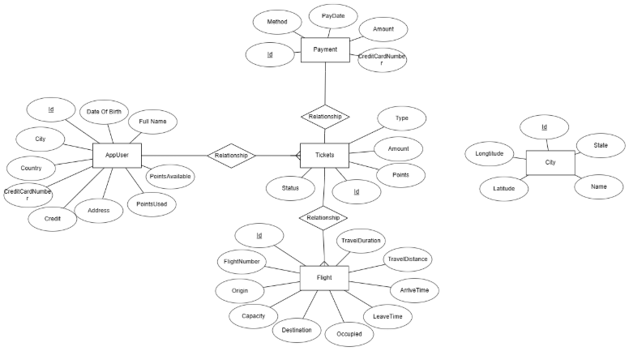
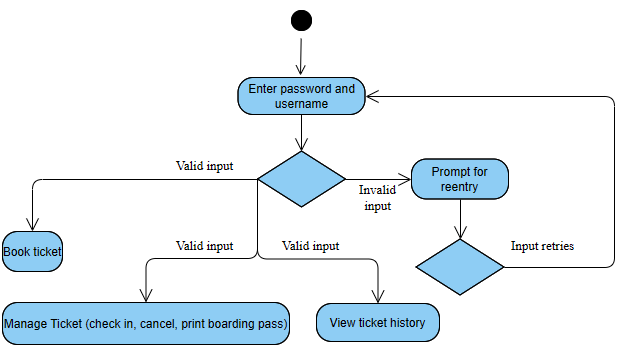
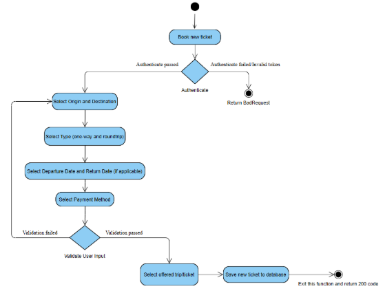
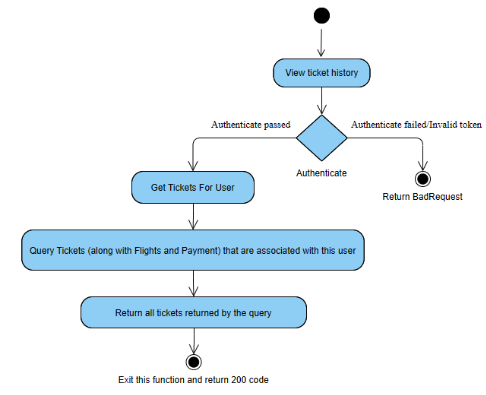
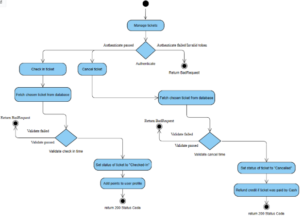
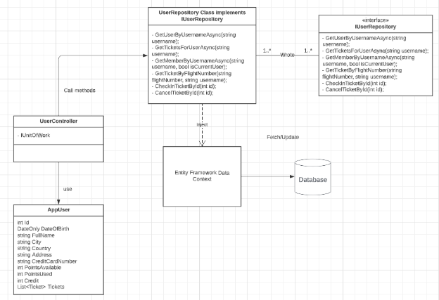
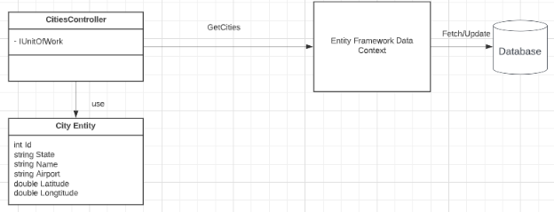
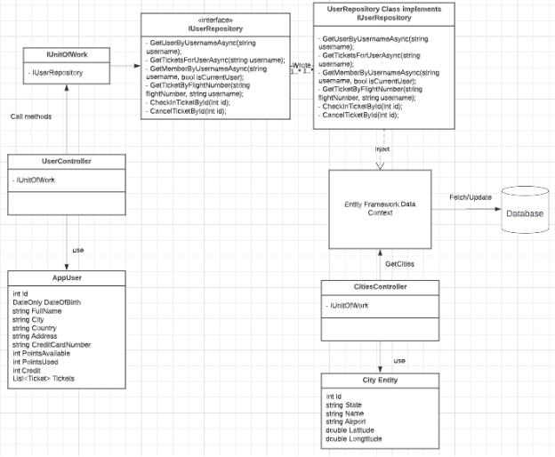
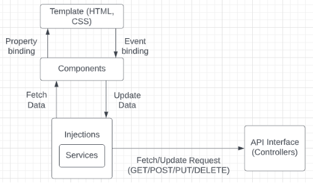

**EECS 3550**

**Software Engineering**

**Spring Semester 2023**

**Air3550 Project**

**Design Document**
**\

**\

**Report Author: Hoang Nhat Duy Le**

`			`**Joshua Davenport**

`			`**Sanskar Lamsal**

**Section: 001**

**Date due        	3/19/2023**

**Date submitted        	3/19/2023**
**\

**Grade         	     \_\_\_/100**

**Table of Contents**

**I.** 	Introduction...………….………………….       	3

**II.**       System Architecture...…...………………       4

**III.**    Frontend Architecture…..………………..       6

**IV.**    Backend Architecture…..………………..       10

**V.**    Database Architecture....………………...       12

**VI.**    Map Structure & Flight Path……...……..       13

1. **Introduction**

**1.1 Project Overview**

This project is Air3550 - a replication of a complete reservation system for a new airline. It will include all necessary functions such as a booking system, fight management, and various roles to define how you can interact with the system. For this deliverable, we are constructing a requirement document that consists of an interpretation of each requirement and provides an understanding of potential use cases.

**1.2 Scope**

This project designs and implements a fully functional Airline booking system. It is implemented using a well-designed relational database, using .Net framework and SQL Lite to store all air flight information and can be fetched easily through controllers. A friendly user interface is provided so that various combinations of search criteria can be fetched from the user and generates corresponding database search statements. It also supports a registration and login system where user can provide their username and password to authenticate and perform various operations.

**1.3 Purpose**

The design document will provide a general view of the project architecture (for the frontend and backend) and a comprehensive illustration of the database schema. The purpose of this document is to demonstrate the design of the project according to the requirement and help the team to visualize how to set up the structure of the project. In this document, we will go through the main architecture of the back-end side and the front-end side.

Team Members:

- Hoang Nhat Duy Le
- Joshua Davenport
- Sanskar Lamsal
1. **System Architecture**

   Overall Entity Relationship Diagram showing the relationship between entities

**[IMAGE DESCRIPTION — Entity Relationship Diagram (ERD)]:** This diagram shows the complete data model for the Air3550 airline reservation system. The central entity is **AppUser**, which has the following fields: Id (primary key), Username, Password, DateOfBirth (DOB), FullName, City, Country, Address, CreditCardNumber, PointsAvailable, PointsUsed, Credit, Tickets (list), UserRoles, PhoneNumber, and Email. AppUser has a **one-to-many relationship with Tickets** — each user can have multiple tickets, but each ticket belongs to one user. The **Ticket** entity connects to **Payment** in a **one-to-one relationship** (each ticket has exactly one payment), and connects to **Flight** in a **one-to-many relationship** (a ticket can include multiple flights for connection/round-trip routes, but each flight segment is tied to one ticket). There is also a separate **City** entity with fields: Id, State, Name, Airport, Latitude, and Longitude — used to store the 10 supported airports and compute distances between them. The ERD visually shows the cardinality and foreign key relationships among all five main entities: AppUser, Ticket, Payment, Flight, and City.

   UML Activity Diagrams:

- Login Activity

  

  **[IMAGE DESCRIPTION — Login Activity UML Diagram]:** This UML Activity Diagram shows the login workflow for the Air3550 airline system. The flow begins with the user entering their username and password. It then reaches a **decision diamond** that checks whether the credentials are valid or invalid. **Valid path:** If credentials are valid, the user is authenticated and the diagram shows three available actions they can take: (1) **Book Ticket** — navigate to the ticket booking flow, (2) **Manage Ticket** — which branches into three sub-actions: Check In, Cancel Ticket, and Print Boarding Pass, and (3) **View Ticket History** — see past bookings. **Invalid path:** If credentials are invalid, the system prompts the user to re-enter their username and password, creating a retry loop back to the credential input step. The diagram uses standard UML notation with a filled circle start node, diamond decision gates, rectangular activity bars, and a filled circle with outer ring as the end node.

- Book new ticket activity

  **[IMAGE DESCRIPTION — Book New Ticket Activity UML Diagram]:** This UML Activity Diagram shows the complete step-by-step flow for booking a new ticket in the Air3550 system. The flow is: **Start → Authenticate user** (decision: if authentication fails → return BadRequest HTTP error; if passed → continue) **→ Select Origin City → Select Destination City → Select Ticket Type** (one-way or round-trip) **→ Select Departure Date** (and Return Date if round-trip) **→ Select Payment Method** (cash or loyalty points) **→ Validate User Input** (decision: if validation fails → return BadRequest error; if passed → continue) **→ Select offered trip/ticket** (system proposes available flights for the chosen route and dates) **→ Save new ticket to database → Exit (return HTTP 200 OK)**. Each decision node shows two branches: a failure branch that returns an appropriate HTTP error code, and a success branch that continues the booking flow. The diagram uses standard UML notation with swim lanes implicitly separating user actions from system actions.

- View ticket history activity

  **[IMAGE DESCRIPTION — View Ticket History Activity UML Diagram]:** This UML Activity Diagram shows the workflow for viewing a user's ticket history. The flow is: **Start → Authenticate user** (decision: if authentication fails → return BadRequest/unauthorized error; if passed → continue) **→ Get Tickets For User → Query Tickets** (the system queries all Ticket records associated with the authenticated user, joining with their associated Flights and Payment records) **→ Return all tickets (along with Flights and Payment data) → Exit (return HTTP 200 OK)**. The diagram shows that the ticket history query performs a JOIN across three related entities — Ticket, Flight, and Payment — so the returned data includes the complete ticket record with all associated flight segments and payment information. The failure branch on authentication exits early with an error response. This is a relatively simple, read-only flow with no user input beyond authentication.

- Manage Ticket Activity

  

  **[IMAGE DESCRIPTION — Manage Ticket Activity UML Diagram]:** This UML Activity Diagram shows two parallel ticket management workflows triggered after authentication. The flow starts with **Start → Authenticate** (failure → error). After successful authentication, the diagram splits into two parallel paths: **Path 1 — Check In Ticket:** Fetch the ticket → Validate check-in time (the check-in window must be within the allowed time window before departure) → Set ticket status to "Checked-in" → Add loyalty points to the user's balance → Return HTTP 200 OK. **Path 2 — Cancel Ticket:** Fetch the ticket → Validate cancel time (cannot cancel a completed flight) → Set ticket status to "Cancelled" → If ticket was paid by cash/credit: Refund credit to user's account balance → Return HTTP 200 OK. Both paths perform a database fetch of the ticket first, then apply their respective business rules before updating the ticket status record. The diagram uses parallel activity bars to show that these are two distinct operations available under the "Manage Ticket" feature, not concurrent operations.

1. **Backend Architecture**
1. **Building Blocks:**
- **Entities:** an entity represents a table in a relational database, and each entity instance corresponds to a row in that table.

  Ex: User Entity: table of all users (customers)

- **Repository:** we use this to create an abstraction layer between the data access and the business logic layer of an application. A repository is nothing but a class defined for an entity, with all the possible database operations.

  => By using it, we are promoting a more loosely coupled approach to access our data from the database.

  => Each entity needs a separate query to fetch/update directly and will require to have a repository to communicate with the database

- **Controllers:** the Controller in MVC architecture handles any incoming URL request.
- **DataContext:** The DataContext is the source of all entities mapped over a database connection. It tracks changes that you made to all retrieved entities and maintains an "identity cache" that guarantees that entities retrieved more than one time are represented by using the same object instance.

  Source: <https://learn.microsoft.com/en-us/dotnet/api/system.data.linq.datacontext?view=netframework-4.8.1>

- **Data Transfer Object (DTO):** an object that carries data, that can be transferred along with the request
- **Unit Of Work:** The Unit of Work pattern is used to group one or more operations (usually database CRUD operations) into a single transaction or “unit of work” so that all operations either pass or fail as one unit.

  Source: <https://dotnettutorials.net/lesson/unit-of-work-csharp-mvc/> 

1. **User Entity: require a UserRepository**

   Properties:

   - Id: every customer will have a unique ID

   - Username: username to login

   - Password: password to login

   - DateOfBirth

   - FullName: the real name of the customer

   - City

   - Country

   - Address

   - CreditCardNumber

   - PointsAvailable: available points to use when purchasing tickets

   - PointsUsed: the total amount of points that have been used by this customer

   - Credit: equivalent to the dollar amount, can be used to purchase tickets

   - Tickets: list of tickets that have been booked by this customer

   - UserRoles: role of this user

   - PhoneNumber

   - Email

   Relationship with other entities:

- Tickets: This is a one-to-many relationship. Each user can have multiple tickets but one ticket can be purchased by one user.
- UserRoles: this is a many-to-many relationship. Each user can have multiple roles and each role has multiple users.

  

  **[IMAGE DESCRIPTION — User Entity Class Diagram]:** This class diagram shows the software architecture for the User entity in the Air3550 backend. The diagram shows three main components: (1) **UserRepository** — implements the **AppRepository** interface, which defines generic CRUD operations (GetAll, GetById, Add, Update, Delete). The UserRepository provides these implementations for the AppUser entity specifically. (2) **UserController** — the ASP.NET MVC controller that handles incoming HTTP requests related to user operations. It calls UserRepository methods to access/modify user data. (3) **AppUser class** — the entity class with all properties: Id, Username, Password, DateOfBirth, FullName, City, Country, Address, CreditCardNumber, PointsAvailable, PointsUsed, Credit, Tickets (ICollection), UserRoles (ICollection), PhoneNumber, Email. The **Entity Framework DataContext** sits between the repository and the actual database, managing the object-relational mapping. A **1-to-1 relationship** indicator is shown in the diagram. The overall flow is: Controller → Repository → DataContext → Database.

1. **City Entity: do not require a repository**

   Properties:

   - Id: every city will have a unique ID

   - State: state of this city

   - Name: name of this city

   - Airport: service airport of this city

   - Latitude: latitude of the current city. Used to compute the distance between cities

   - Longitude: longitude of the current city. Used to compute the distance between cities

- Note: since it only needs one method, it is not necessary to create a repository for this entity.

  **[IMAGE DESCRIPTION — City Entity Class Diagram]:** This class diagram shows the architecture for the City entity in the Air3550 backend. Unlike the User entity, the City entity does **not require a Repository** because it only needs a single query method (GetCities). The diagram shows: (1) **CitiesController** — the ASP.NET MVC controller that handles incoming HTTP requests for city/airport data. It has a dependency on **IUnitOfWork** (interface). The controller exposes a **GetCities** method that returns all available cities/airports. (2) **Entity Framework DataContext** — connects to the underlying database to fetch City records. (3) **City Entity class** — with fields: int Id, string State, string Name, string Airport, double Latitude, double Longitude. The Latitude and Longitude fields are used to compute straight-line distances between airports (using the Haversine or Euclidean distance formula) to determine flight prices. The diagram shows the direct controller → DataContext → Database flow without an intermediate repository layer, since the city data is essentially read-only seed data.

1. **Flight, Payment, and Ticket Entities: do not require a repository since we can fetch these entities along with their associated user.**

**Flight Properties**

\- Id: every flight has a unique Id

\- FlightNumber: every flight has a flight number

\- Origin: original city (airport)

\- Destination: destination city (airport)

\- LeaveTime: take off time

\- ArriveTime: arrive time

\- TravelDistance: total distance traveled

\- TravelDuration: total time (in hours) traveled

\- Model: the model of the plane used in this flight

\- Capacity: total number of passengers

\- Occupied: actual number of passengers

- Relationship with other entities:

  Ticket: this is a one-to-many relationship. Each ticket may have multiple flights (connection flights, round-trip tickets) but a flight can only be associated with one ticket.

**Payment Properties**

\- Id: every payment has a unique Id

\- Method: Cash or Credit

\- PayDate: the same as the day the ticket was booked

\- Amount: the number of dollars

\- CreditCardNumber: if paid by cash, what was the credit card number?

- Relationship with other entities:

  Ticket: this is a one-to-one relationship. Each ticket can only have one payment and a payment can only be associated with one ticket.

  **Ticket Properties**

  - Id: every payment has a unique Id

  - Flights: list of flights associated with this ticket

  - Payment: the payment associated with this ticket

  - Type: one-way or round trip

  - Amount: the price of this ticket

  - Points: the number of points that ticket is worth of

  - Status: check-in, canceled, or complete

- Relationship with other entities:

  AppUser: this is a one-to-many relationship. Each user can have multiple tickets but one ticket can be purchased by one user.

1. **Final Backend Architecture:**

   **[IMAGE DESCRIPTION — Full Backend Architecture Diagram]:** This comprehensive architecture diagram shows the complete backend structure for the Air3550 airline reservation system built with ASP.NET Core. The diagram shows all entities, repositories, controllers, and their interconnections. **Entities:** AppUser (with UserRoles), Ticket, Payment, Flight, and City — each representing a table in the SQLite/SQL database. **Repositories:** UserRepository implements AppRepository (generic interface with CRUD methods: GetAll, GetById, Add, Update, Delete). The AppRepository pattern enforces a consistent data access layer. **Controllers:** UserController (manages user CRUD and authentication), CitiesController (provides city/airport data via GetCities). **Unit of Work:** The IUnitOfWork interface groups multiple repository operations into a single transaction — ensures that related database changes either all succeed or all fail together, maintaining data integrity. **DataContext:** Entity Framework's DataContext manages the object-relational mapping between C# entity objects and the underlying database tables. **Data Transfer Objects (DTOs):** Used to pass data between controllers and the frontend without exposing the full entity model. The overall architecture follows a layered pattern: HTTP Request → Controller → Unit of Work → Repository → DataContext → Database, with DTOs used at the controller boundary.

1. **Frontend Architecture**

`		`\* We are using Angular to serve the front end of the application.

1. **Building Blocks:**
- **Components:** Components are the main building block for Angular applications. Each component consists of:
  - An HTML template that declares what renders on the page
  - A TypeScript class that defines the behavior
  - A CSS selector that defines how the component is used in a template
- **Services:** Components shouldn't fetch or save data directly. They should focus on presenting data and delegating data access to a service. They contain methods that maintain data throughout the life of an application, i.e., data is available all the time. 

  => The main objective of a service is to organize and share business logic, models, or data and functions with different components of an Angular application. They are usually implemented through dependency injection.

  => In this project, services are mainly used to fetch data from the database as well as update/delete.

1. **Final Backend Structure:**

**[IMAGE DESCRIPTION — Angular Frontend Architecture Diagram]:** This diagram shows the frontend architecture for the Air3550 web application using Angular. The diagram illustrates the Angular component model and data flow pattern. The architecture has three main layers: (1) **Template Layer** — HTML and CSS files that define what is rendered on the page. Templates connect to Components via **property binding** (data flows from Component to Template, e.g., displaying values) and **event binding** (user actions in the Template trigger Component methods, e.g., button clicks). (2) **Component Layer** — TypeScript classes that define the behavior of each UI element. Components do not directly fetch or save data; they delegate data access to Services. Components interact with Templates bidirectionally through Angular's binding system. (3) **Services Layer (Injections)** — Angular Services are injected into Components via dependency injection. Services are responsible for fetching data from and updating data to the backend API. Services make HTTP requests (GET, POST, PUT, DELETE) to the **API Interface (Controllers)** on the backend. The diagram shows that the flow of data is: User interacts with Template → Template triggers Component event → Component calls Service method → Service makes HTTP request to Backend API → API returns data → Service passes data back to Component → Component updates Template via property binding.

1. **Database Architecture**

   

   **[IMAGE DESCRIPTION — Database Class Diagram]:** This class diagram shows the complete database schema and entity relationships for the Air3550 airline reservation system. The diagram shows five entity classes with their full properties and methods: (1) **AppUser-with-Roles** — fields: Id, Username, Password, DOB, FullName, City, Country, Address, CreditCardNumber, PointsAvailable, PointsUsed, Credit, Tickets, UserRoles, PhoneNumber, Email. Methods: ChooseFlight(), ModifyFlight(), ViewFlights(). (2) **AppUser** (base class) — same fields with methods: BookTicket(), CancelTicket(), CheckIn(), PrintBoardingPass(), ViewHistory(), ManageAccount(). (3) **Ticket** — fields: Id, Type (one-way/round-trip), Amount (price), Points (loyalty points earned), Status (checked-in/cancelled/complete), List\<Flights\>. Relationships: many-to-one with AppUser (many tickets per user), one-to-many with Flights, one-to-one with Payment. (4) **Payment** — fields: Id, Method (Cash/Points), PayDate, Amount, CreditCardNumber. Relationship: one-to-one with Ticket. (5) **Flight** — fields: FlightNumber, Origin (airport), Destination (airport), LeaveTime, ArriveTime, Duration (travel hours), PlaneModel, Capacity (total seats), Occupied (booked seats). Relationship: many-to-one with Ticket (each flight belongs to one ticket, but a ticket can have multiple flights). The diagram shows the cardinality arrows between all entities, illustrating the complete relational data model.

1. **Map Structure & Flight Path**

We have decided to serve 10 airports. Each airport is the largest airport of that state (or one of the largest):

- Cleveland Hopkins International Airport	
- Dallas Fort Worth International Airport	
- Detroit Metro Wayne County Airport	
- Harry Reid International Airport	
- LaGuardia Airport	
- Miami International Airport	
- Nashville International Airport	
- Phoenix Sky Harbor International Airport	
- San Francisco International Airport	
- Seattle-Tacoma International Airport

**[IMAGE DESCRIPTION — US Airport Map with Flight Routes]:** This is a map of the continental United States showing the 10 airports served by the Air3550 airline system and the hardcoded flight paths between them. The 10 airports are: **Cleveland Hopkins International Airport** (Cleveland, OH), **Dallas Fort Worth International Airport** (Dallas, TX), **Detroit Metro Wayne County Airport** (Detroit, MI), **Harry Reid International Airport** (Las Vegas, NV), **LaGuardia Airport** (New York City, NY), **Miami International Airport** (Miami, FL), **Nashville International Airport** (Nashville, TN), **Phoenix Sky Harbor International Airport** (Phoenix, AZ), **San Francisco International Airport** (San Francisco, CA), and **Seattle-Tacoma International Airport** (Seattle, WA). The airports are shown as labeled points on the US map. **Colored lines** connect the airports to show the available direct flight routes between them — each line represents a bidirectional connection (the same path can be used in both directions, e.g., Cleveland to Detroit and Detroit to Cleveland). Not all airports are directly connected; some routes require connection flights through intermediate airports. The geographic distribution covers the Northeast (LaGuardia, Cleveland), Southeast (Nashville, Miami), Midwest (Detroit), South (Dallas), Southwest (Phoenix, Las Vegas), and West Coast (San Francisco, Seattle).

For this project, we will only hardcode paths from one airport to one airport. This will simulate the progress of generating a real path. We have come up with a table listed down below for more details:

- Straight: there is a straight path from one airport to another airport. No connection flight is needed.
- If it requires to have a connection flight, we have tried to choose to the shortest path leading to the destination.
- Each path can be used by both airports that it connects.

  => For example: we can go from Detroit to Harry Reid and we can go from Harry Reid to Detroit using the same path

**[IMAGE DESCRIPTION — 10×10 Flight Path Matrix Table]:** This is a 10×10 routing matrix showing the available flight paths between all 10 airports in the Air3550 system. Both the rows and columns represent the 10 airports: Cleveland, Dallas, Detroit, Harry Reid (Las Vegas), LaGuardia (NYC), Miami, Nashville, Phoenix, San Francisco, and Seattle. Each cell in the matrix describes how to travel from the row airport to the column airport. **"Straight"** in a cell means there is a direct non-stop flight between those two airports. For routes without a direct flight, the cell lists the **connection airport(s)** required for the journey (e.g., "Cleveland-Detroit, Harry Reid-Phoenix" means you fly Cleveland→Detroit first, then connect to a Detroit→Phoenix leg). The diagonal cells are blank (you can't fly from an airport to itself). All paths are bidirectional — the table is used symmetrically. This matrix was hardcoded in the application to simulate a realistic (but not fully-connected) airline route network. The routing logic uses this table to propose trips to customers, selecting the shortest available path from origin to destination. Example routes from the matrix: Cleveland to Detroit = Straight (direct flight); Cleveland to Seattle = requires connections through intermediate airports.

