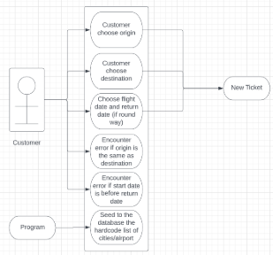
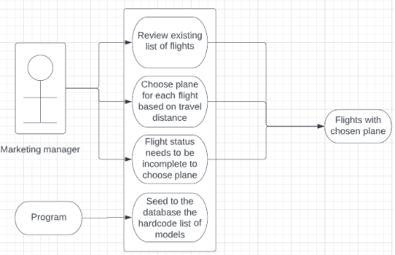
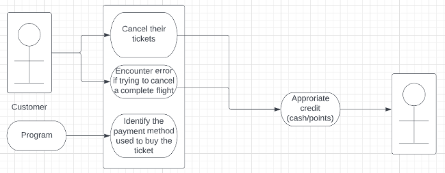
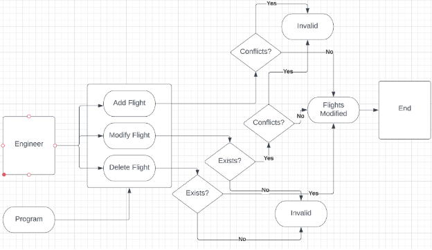
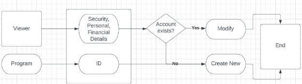
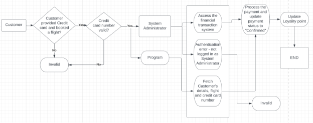
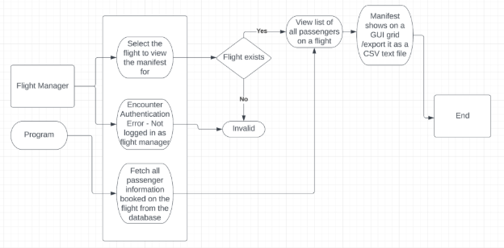
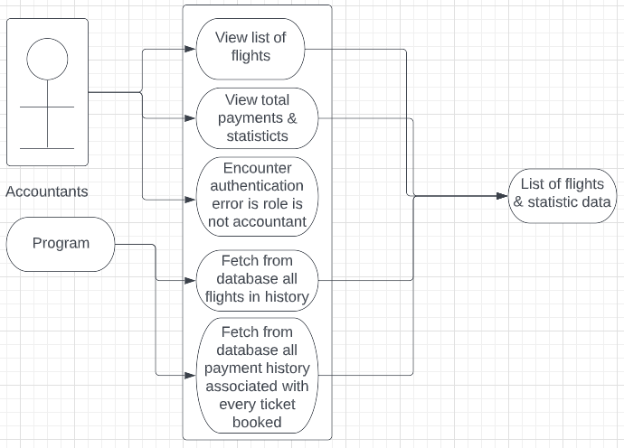
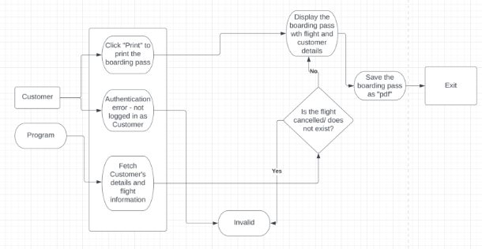
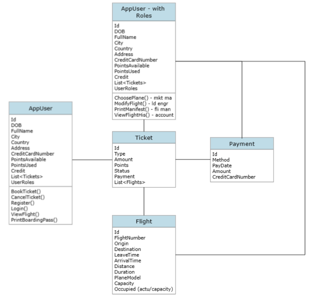


**EECS 3550**

**Software Engineering**

**Spring Semester 2023**

**Air3550 Project**

**Requirements Document**
**\

**\

**Report Author: Hoang Nhat Duy Le**

`			`**Joshua Davenport**

`			`**Sanskar Lamsal**

**Section: 001**

**Date due        	2/26/2023**

**Date submitted        	2/26/2023**
**\

**Grade         	     \_\_\_/100**

**Table of Contents**

**I.** 	Introduction ..………….………………….       	3

**II.**       Use Cases ……………...………………...       4

**III.**    Additional Requirements ………………..       13

**IV.**    Database Architecture ...………………...       17

1. **Introduction**

This project is Air3550 - a replication of a complete reservation system for a new airline. It will include all necessary functions such as a booking system, fight management, and various roles to define how you can interact with the system. For this deliverable, we are constructing a requirement document that consists of an interpretation of each requirement and provides an understanding of potential use cases.

The requirement document will provide an analysis of the project requirements as well as a comprehensive illustration of all use cases. The purpose of this document is to demonstrate the group's understanding of the project requirement and help the team to have a better idea of how users want to interact with the system. In this document, we will go through every requirement and analyze each case (if applicable) associated with that requirement.

Team Members:

- Hoang Nhat Duy Le
- Joshua Davenport
- Sanskar Lamsal
1. **Use Cases**

**Use Case 1 - Book Ticket**

From requirements: 1, 5, 6, 10, 14, 19.

**Primary actor:** Customer. 

**Goal in context:** 

- Customers can choose the cities being served by our airline/project (the origin and destination are different). Need to include Nashville and Cleveland.
- Customers can choose the type of tickets - one-way or round trip
- Tickets can be booked 6 months in advance
- Customers will book tickets themselves; there is no Booking Agent user
- Customers can book flights with points if they have enough (100 points per dollar for the flight costs)
- Program will compute the points for each ticket booked (10 points per dollar spent) and keep track of the payment method of each ticket for canceling situation
- Program will be able to propose flights to customer

**Preconditions:** Pre-chosen list of cities and the paths to travel between them. These cities will be chosen by the Flight Engineer through our API.

**Trigger:** The customer decides to book a ticket

**Scenario:** 

1. Customer: book a new ticket - choose the ticket type 
1. Customer: choose their origin 
1. Customer: choose their destination
1. Customer: choose flight date and return date (if applicable)
1. Program: the program will propose the path from the origin to the destination
1. Program: add points to customer balance, if it was not paid for with points itself, and keep track of payment method

**Exceptions:** 

1. Origin and Destination are the same ⇒ Customer chooses a different origin/destination
1. Flight Date is later (or equal to) the Return Date ⇒ Throw an exception

**Use Case 2 - Marketing Manager Chooses Planes for Flights**

From Requirement 4, 8

**Primary actor:** marketing manager. 

**Goal in context:** marketing manager can choose what planes to use for each flight based on the distance it will travel.

**Preconditions:** There should already be a list of flights to choose and depending on the travel distance it will make, the marketing manager will decide which plane to use

**Trigger:** The marketing manager decides to choose a plan from our existing list containing different models. 

**Scenario:** 

1\. Marketing manager: review the list of flights 

2\. Marketing manager: choose a plane for each flight based on the travel distance

**Exceptions:** 

1\. Marketing manager should only be able to choose a plane for incomplete flights (when the current date has not passed the flight date)

**Use Case 3 - Customer Cancels Flight**

From Requirement 11, 13

**Primary actor:** Customer. 

**Goal in context:** Customers will be able to cancel their tickets and get the corresponding refund (if using cash, we refund them by credit. If using points, we credit them back with points).

**Preconditions:** customers should already have at least one flight to cancel

**Trigger:** The customer decides to cancel their ticket. 

**Scenario:** 

1. Customer: Selects an existing ticket
1. Customer: Cancels the selected ticket
1. Customer: Confirms the cancellation
1. Program: the program processes the cancellation and refunds the customers accordingly 

**Exceptions:** 

1. When customers cancel their complete ticket, it should not be allowed
1. If refunding the flight would give them negative points, it should not be allowed (this is possible if they purchase a flight with points after purchasing a flight with cash)

**Use Case 4 - Manage Schedule of Flights**

From Requirement 9

**Primary actor:** Load engineer. 

**Goal in context:** Load engineers will be able to manage the schedule of flights between cities - add, delete, and edit the list of available origins, destinations, and times. The same flights operate 7 days a week.

**Preconditions:** User is a load engineer; when deleting or editing, the flight must exist; when creating or editing, the new flight cannot conflict with an existing flight

**Trigger:** The load engineer manages existing flights

**Scenario:** 

1\. Load engineer: select manage existing flights

2\. Program: Lists existing flights

3\. Load engineer: select modify a flight from New York to Nashville

4\. Load engineer: changes the start time from 4:00 AM Tuesday to 4:00 PM Tuesday

5\. Program: Saves the change and displays the new start time when queried.

**Use Case 5 - Register a Customer’s Account**

From Requirements 12, 15

**Use case**: 

Customer creates and manages their account information

**Primary Actor**: 

Customers

**Goal in Context:** 

Customer can create their account; manage their personal information, billing information, and password; as well as view their flight history and loyalty points

**Preconditions:** 

The customer has accessed the airline website

**Trigger**: 

The customer decides to create an account with the airline

**Scenario**:

1. Customer accesses the airline website
1. Customer clicks the create account
1. Customer enters their personal information including their credit card information
1. Customer clicks the “Create Account” button and it will create their account
1. Customer logs in using their customer ID and password
1. Customer checks their loyalty point and flight history
1. Customer updates their personal information and password as needed

**Exceptions:**

1. Customer enters invalid information when creating an account so the system throws an error
1. Customer logs in using an incorrect ID/password then the system throws “Incorrect ID/password”

**Priority:**

`	`Essential, must be implemented

**When available:**

`	`Always

**Frequency:**

`	`Each time a new customer makes an account

**Channel to the actor:**

`	`Via the airlines website

**Open issues:**

1. Do we accept all credit cards and do we check the correctness of credit card information?
1. Does the email address need verification and do we implement 2FA?

**Use Case 6 - Process Financial Transaction**

From Requirement 17

**Primary Actor**: 

System Administrator

**Goal in Context:**

` `To create a record of a customer's financial transaction including the customer's name, credit card number, and amount to charge

**Preconditions:** 

The customer has provided their credit card information and has booked a flight

**Trigger**: 

The customer’s flight is confirmed and the payment is due

**Scenario**:

1. System Admin accesses the financial transaction system
1. System Admin searches for the customer’s booking with the credit card number
1. System Admin processes the payment
1. The system records the transaction including the customer’s name, credit card number, and the amount charged
1. The system updates the loyalty points if applicable

**Exceptions:**

1. The information entered by the customer is incorrect

**Priority:** 

Essential, must be implemented

**When available:** 

Always

**Frequency:** 

Each time a new customer’s flight is confirmed and the payment is due

**Channel to the actor:** 

Via the airlines financial system

**Open issues:**

1. Do we encrypt the credit card information?
1. What if the credit card number is incorrect?

**Use Case 7 - Print Flight Manifests for Flight Manager**

From Requirement 20

**Primary Actor**: 

Flight manager

**Goal in Context:** 

Flight manager should be able to print the list of all the passengers on a flight before it takes off

**Preconditions:** 

The flight manager has logged into the system and the flight exists

**Trigger**: 

The flight manager selects the flight for which they want to print the manifest for

**Scenario**:

1. The flight manager logs in as a Flight manager
1. The flight manager selects a flight for which they want to print the manifest
1. The system generates a list of all the passengers booked on the flight
1. The flight manager can view the manifest on a GUI grid or export it as a CSV text file

**Exceptions:**

1. Not logged in as Flight Manager

**Priority:** Essential, must be implemented

**When available:** Always

**Frequency:** Each time a flight manager needs to print a manifest

**Channel to the actor:** Via the airlines reservation website

**Open issues:**

1. What do we do if there are no passengers on the flight?
1. What to do if the flight does not exist?

**Use Case 8 - Print Flight Records for Accountants**

From Requirement 21

**Primary Actor**: Accounting Manager

**Goal in Context:** Accountants should be able to how many flights we’ve had, how full each one was, and the income per flight. They should also know the income of the company as a whole.

**Preconditions:** The accounting manager has logged in

**Trigger**: The accounting manager views the accounting statistics

**Scenario**:

1. The accounting manager logs in as an Accounting manager
1. The accounting manager views the accounting statistics
1. The system generates a list of flights, alongside their percentage of capacity and income
1. The system produces a list of how many flights we’ve had and the total income

**Exceptions:**

1. User is not an accounting manager

**Priority:** Very high, part of the requirements

**Frequency:** Each time the accountants view flights (daily?)

**Channel to the actor:** Via the airlines reservation website

**Open issues:**

1. Should this produce a CSV only, a GUI only, or both?

**Use Case 9 -** Customer prints their boarding pass

From Requirement 16

**Primary Actor**: Customers

**Goal in Context:** Customer can print their boarding pass with all essential information for the upcoming flight

**Preconditions:** The customer has created an account and has booked a flight

**Trigger**: Customer decided to print their boarding pass 24 hours before the flight time

**Scenario**:

1. Customer logs into their account on the airline website
1. Customer selects the flight for which they want to print the boarding pass
1. System displays the boarding pass with Flight number, Customer’s name, Departure and Arrival time, and Account number
1. Customer clicks on the “Print” button which will save the boarding pass as “pdf” through a system prompt

**Exceptions:**

1. The customer has not logged in
1. If there is any problem with the flight
1. If there is anything wrong with the customer’s reservation on the flight

**Priority:**

`	`Essential, must be implemented

**When available:**

`	`24 hours before the flight time

**Frequency:**

`	`Once per customer per flight

**Channel to the actor:**

`	`Via the airlines website and inside the user’s account

**Open issues:**

1. N/A

1. **Additional Requirements**

**Requirement 2:**

You need to know the (straight-line) distances between airports.

Solution: The program has a method to compute straight line distance between airports using the latitude and longitude of the 2 airports.

**Requirement 3:**

You won’t have direct flights from everywhere to everywhere else. This isn’t a fully-connected graph.

Solution: We are serving 10 airports. Therefore, we will provide paths from each airport to other airports. This is a hardcoded map.

**Requirement 7:**

Pricing for tickets is $50 (for fixed costs), plus twelve cents per mile between airports (longer flights take more fuel, more hours of flight attendants’ time, put more wear on the plane, which means more maintenance, etc.), and a mandatory $8 per segment federal fee to pay for the TSA agents (if a flight lands between its origin and destination, every time it takes off, that’s $8). Flights leaving before 8 AM, or arriving after 7 PM receive a 10% off-peak discount. Flights leaving or arriving between midnight and 5 AM receive a 20% red-eye discount.

Solution: 

Price = 50$ + 0.12$/mile + 8$

- Leaving before 8 AM: Price = 90% \* Price
- Arriving after 7 PM: Price = 90% \* Price
- Leaving & arriving between midnight and 5 AM: Price = 80% \* Price

**Requirement 12a:**

Each user will have a unique 6-digit (can’t start with zero), randomly assigned customer number (which will act as their user ID), tied to their name and address.

Solution: As it says. The customer’s ID will be randomly generated and will be attached to their entry in the database. In the event of a collision, the ID will be increased by 1 until no collision occurs. Their name and address will also be part of their entry.

**Requirement 12d:**

We will store their password as an SHA-512 hash of the real password.

Solution: As it says. The customer’s password will *not* be in the database, but an SHA-512 hash of it will be attached to their entry.

**Requirement 18:**

Each flight will have a flight number, an origin city (and code), a destination city (and code), and an associated price and number of points that purchasing that flight will earn.

Solution: Flights will be stored separately from tickets, including all of this data.

**Database Architecture**

