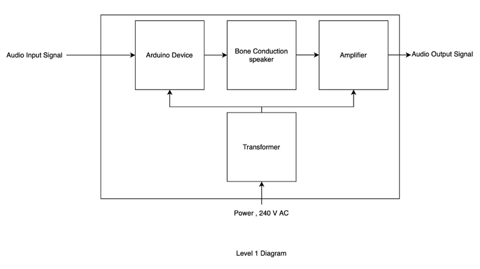
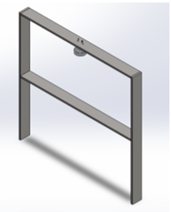
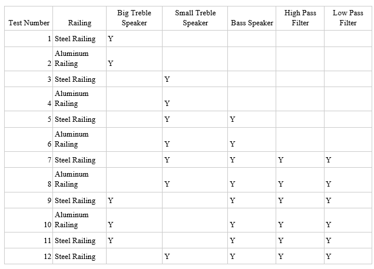
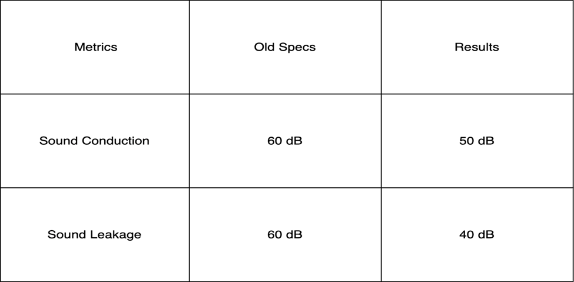

Problem Statement:
2022 is the 150th Anniversary of the University of Toledo, and the College of Arts and Letters approached us to create a memorial in celebration of the Sesquicentennial anniversary of University of Toledo (150 years). With the sponsorship of the College of Arts and Letters, as well as the UT green fund, we were tasked with adding a unique art installation on campus that students and guests would be able to interact with that shared the history of Toledo.
We aim to create a prototype fixture that transmits sound through users' forearm bones, enabling them to hear campus sounds, inspired by Dresden's art installation.  Our railing can be installed at Carlson Library, UT Health Science campus, and the Engineering Campus. Through this, we want to liven up campus and allow for those on each campus to listen to some famous events in Toledo history and maybe learn a little about how sound and bone conduction work. 
Background:
Hearing loss is a global problem that can severely impact the quality of life of every person suffering from it, since it impairs a basic and very much needed skill, and that is communication. Good listening and communication are essential for employment, phone calls, ordering food, and staying alert. Hearing loss can lead to behavioral issues and mood swings.
A study posted by the National Library of Medicine relates the problem of hearing loss with the struggles and hardships patients face and how it can deteriorate their quality of life. It shows a direct correlation between patients with hearing loss and low education, low income and unemployment or underemployment.
The article is very well related to the bone conduction project since it provides us engineers with the capability of making the lives of people who suffer from hearing loss better and more enjoyable.
The most important thing we learned from that article is the fact that people who suffer from hearing loss can suffer emotionally, behaviorally as well as socio-economically.
We as engineers have the responsibility of facilitating those people’s lives, and if we can do so by making bone conduction more advanced through electronic devices, and maybe incorporate them into phones as well, we have to work on it and make it possible.
Our inspiration was the “Touched echo” project located at the Brühlsche Terrasse in Dresden, Germany. The installation lets visitors experience the sounds of WWII bombing in Dresden, featuring airplane howls and bomb explosions. Visitors must lean onto the terrace railing with their hands covering their ears to hear the sounds, which are transported through bone conduction. The installation is intended to provide a moment of silent contemplation and remembrance of the estimated 25,000 civilians who died during the bombing. The bombing of Dresden was one of the most controversial Allied actions during WWII, as no distinction was made between military and civilian targets, and many of the destroyed buildings were considered to be some of the most beautiful in Germany. It took 60 years for the Frauenkirche church, one of the destroyed buildings, to be reconstructed. The art installation was created in 2007 by Markus Kison, a student at the Universität der Künste in Berlin.

Design
The Design Process
We started by creating a list of requirements needed in order to satisfy our customers with our project. The following are the requirements we used as our guidelines for creating our design:
Audible for users in contact and not audible to non-users
1.	The product must be reproducible in terms of cost and materials but does not need to be mass-producible.
2.	The product must work continuously with minimal maintenance required for the end user.
3.	The product must be reliable and usable without undue risk of injury
4.	The device should always play in a loop without any maintenance except in case of malfunctions
5.	The product will be usable to any pedestrian, regardless of height.
6.	Product manufactured by April 2023

The design of our project was handled in two main phases: collaboration with the MIME engineers during the first semester of our senior design project and iterating on our project without assistance during the second semester of our project. In the beginning, our team focused on the software end of the project as the MIME engineers were tasked with research and development of the railing itself. We needed a device that could store music files and play them on loop endlessly with only access to power as an input. We narrowed our search to devices that were lower in cost, more user friendly to develop, allowed for easy changing of music files after initial installation, and our team had some experience in. This resulted in us choosing the Arduino duo as well as the Arduino Shield as the brain that our software would live on, the sound files would be stored on, and whose output would run to the railing speakers.

Design Development
Functional Design:
Level 0:

Level 1:

Behavioral Design:

House of Quality diagram:

Description/Explanation of house of quality diagram:
As seen above, we have 6 engineering requirements: total harmonic distortion THD, output power, efficiency n, install time, dimensions, and cost. In addition to the engineering requirements, we have 4 marketing requirements: sound quality, high power, install ease, and cost.
The arrows depict how strong/weak a positive/negative correlation is between the engineering requirement and the marketing requirement.
Let’s take the output power of our bone conduction audio device as an example. The first row shows us that the higher power output can be obtained at the expense of the total harmonic distortion.
The more efficient the bone conduction device  is, the more power it can output. This is clearly shown by the upward arrow depicting a positive correlation between both requirements. In addition, larger components and greater area means more dissipation in power, which is why we see a negative correlation between the dimensions and the output power.
Finally, the greater the dimensions of our device and the number of components we need for higher power, the greater our cost is, which is why we see a negative correlation between the output power and the cost.

Alternative Design Considerations

Our first prototype was made of regular 1018 steel or stainless steel. The reason is because the initial intent of the project was to place it outside on the University of Toledo’s campus meaning that the railing would have to go through lots of thermo cycling between Toledo’s hot summers and chilling winters. Additionally, a powder coating was added to it later to prevent the weather from affecting our railing. This prototype produced acceptable results but did not really meet the standards mentioned in the project statements. Therefore, it has been proved by our tests that aluminum is a better choice even though with less sound conduction, because it produces less sound leakage compared to steel. 
For our final prototype, we have tried to reconstruct the railing system along with the speaker system. First of all, a new aluminum bar will be applied to the top of the railing, as well as a new speaker system involving two separate speakers will be implemented: one to cover frequencies 100Hz and below, one to cover 100Hz and above. Additionally, since our plan has been changed from installing the railing outdoor to indoor, a new base to mount the railing, making the railing much more sleek and refined, and optimizing the railing for use indoors. Finally, a housing enclosure is attached to the base of the railing, containing all hardware components such as Arduino, amplifier, sound filters, … which will be powered by a cord connected to an electrical outlet.
Design Specifications
Our approach is to use Arduino, a microcontroller and an IDE (using C++), taking advantage of current provided libraries that support playing audio files with Arduino in decent quality from SD card.
The sound files are converted to WAV format, then fed to the library tool to provide good quality audio. These files are then read from the SD card in a loop to keep playing infinitely, which allows people to hear sound whenever they place their elbows on the railing.
Sound is amplified from the Arduino output to speaker, which then transmits the sound through the railing system
Testing
Testing Methods and Metrics
Testing for this project can be broken down into two broad categories: audio quality testing and functionality testing. 
Functionality testing for this project was conducted via unit testing and integration testing and was conducted upon completion of each subsystem. The project was broken into 3 individual units: The transducer system, the amplifier and filter system, and the arduino system. By individually testing the systems we could guarantee the functionality of each system before connecting them and performing integration testing. Due to this, we caught several problems with the arduino system and a loose connection in the speaker system before they became much more difficult to identify problems in the final system. 

Audio Quality testing for this project was conducted with both qualitative and quantitative tests. For qualitative tests, several audio files were used with multiple different railings and speaker configurations in order to optimize the audio quality and minimize audio leakage.

We then conducted qualitative analysis on the railing’s audio conduction qualities. To do this, we used Room Enhancement Wizard, software that is used to measure the frequency response of speakers, as well as several specialized microphones and their auxiliary equipment. 
To achieve a comprehensive understanding of the quality of the railing’s audio conduction qualities, we needed to measure two key variables: Conduction intensity and Leakage intensity. We define conduction intensity as the amount of sound that is conducted directly through the railing as opposed to leakage intensity, which is the amount of sound that escapes the railing and leaks out into the surrounding air. 
To measure these two variables, we need two types of microphones, a contact mic and a sensitive audio mic. By measuring the decibel value of the sound that the railing is conducting via the contact mic while measuring the leakage with the sensitive audio mic, we can determine the ratio of leakage to conduction at any frequency, and thus determine which configuration of the railing provides the best audio quality. 
Results

The functionality tests resulted in simple confirmations that each unit was functional. After solving several issues, all subsystems were operating correctly. 
The quality tests provided the information shown below.

Analysis of the Results

both railing configurations.

These results were obtained by comparing the audio conduction and leakage intensity of the two railing configurations and looking to minimize leakage and maximize conduction, with a focus on ~1k - 3k Hz, critical ranges for human hearing that the railing struggled with in the qualitative tests. The measurements are a simplification obtained by measuring the relative leakage and conduction intensities at 2k Hz. 

These results show that the new railing configuration does lose some conduction intensity, but what it loses in conduction intensity it more than makes up for in leakage intensity. This configuration has an overall “gain” of 10 Db, making it the superior option and ultimately the design we chose for our final iteration. 

The Final Design
Bill of Materials

Project Schedule
●	September 2022: Preliminary Design and Component Availability Research
●	October 2022 (Mechanical Group): Build BOM + Purchase Materials + Assemble and Test Prototype
●	October 2022 (EECS Group): Power info for Electrical Research + Speaker & Amplifier Research
●	November 2022: Software Research + Purchase Arduino & SD Card +  Software Implementation
●	December 2022: Speaker Test + Unit Test the software implementation to see if it can output sound to the speaker
●	January 2023: fix playback speed bug + start housing enclosure design
●	February 2023: Researched materials for different fences and speakers’ design + add loop functionality to software implementation
●	March 2023: Performed audio output analysis and audio leakage testing on the current prototype + Created documentation for converting audio files
●	April 2023: Finished up final prototype to prepare a final demo + Ran testing for the new sound devices + Ran testing for the new railing material, both steel and aluminum 

Real World Considerations
Regulatory Standards
Industry Standards and Engineering:
Standard 1: IEC 60268-3 Sound system equipment – Part 3: Amplifiers
This is an international standard that applies to analogue amplifiers, which is a component we are using in our senior design project. This standard clearly specifies the characteristics that we are supposed to include in specifications for the amplifier we have to use, as well as the methods of measurements of these specifications, such as the rated condition of digital input, the tolerance of rated power supply, the maximum effective output power, and many more characteristics.
This standard is applicable to our senior design project because an analogue amplifier is a critical component of our design. Without meeting the proper characteristics to make sure this amplifier functions properly, the output sound may not be efficient, which would render our project ineffective and therefore useless.
This affected our design in terms of testing, since we did not build the amplifier, but bought it. We have to test the amplifier in a multiple of tests to ensure efficiency, and also ensure that the amplifier does meet the specifications mentioned in the international standard above.
Standard 2: ANSI S3.13 1987 American National Standard Mechanical Coupler for Measurement of Bone Vibrators
This standard specified the requirements for mechanical components used for bone-conduction devices and audiometer calibrations, as well as method of measurements on bone vibrators and bone conduction hearing aids. This standard gives specific design features as well as specific physical calibration values for bone conduction.
This standard is applicable to our senior design project because a bone conduction speaker is a critical component of our design. Without meeting the proper calibrations to make sure this speaker functions properly, the output vibrations traveling through the bones of our users may not be audible, which would render our project useless.
This affected our design in terms of ensuring that the bone conduction speaker we have decided to use is capable of meeting the calibrations requirements that are mentioned in the standard above, otherwise we would not be able to sell our design to potential investors and companies.
Ethics/DEI/IP Considerations
Patents:
The first patent is labeled as “BONE CONDUCTION HEADPHONES” and was filed in 2008 by Thomas William Buroojy. The patent was granted by the United States.
In summary, the patent discusses a bone conduction headphone that is composed of two audio elements, which are positioned against the sides of the user’s head, in other words his cheek bones. Thus, the user is capable of listening to his preferred audio while maintaining a high awareness of his surroundings, since his ears are not blocked.
In this implementation, a piezoelectric transducer is housed within a layer of insulating materials inside of the housing of the audio device. These transducers will be coupled with an amplifier and an audio source and will send mechanical vibrations instead of audio signals. However, these vibrations will be interpreted by the brain just like an audio signal would. The main difference being that the user's ear canals are not covered at all, so no hindrance on the ability of detecting ambient sounds.
This patent is very much related to our project. The goal of our project is to use the same technology, that is a piezoelectric transducer, along with an amplifier and an audio source in order to send UT audio clips such as athletic games, arts performances, commencement speeches, and campus activities through new railings that will be put on the Carlson Library bridge. In other words, our project uses the same technology used in these bone conduction headphones, but on a larger scale.
The second patent is labeled as “Bone conduction transducers for privacy” and was filed in 2019 by Apple. The patent was also granted by the United States.
In summary, the patent discusses the capability of an electronic device such as a pair of wireless headphones to detect if the communication is private or public. The device contains two or more audio channels.  If the communication is private, then the device uses the bone conduction transducer and transmits the vibration as an audio signal to the skull of the user. If the device determines that the communication is public, then the device will transmit the audio signal through a speaker, giving people around the user the capability of hearing the audio signal.
This patent is also very well related to our bone conduction project. The goal of our project is to transmit the audio signal to the people walking the bridge if and only if they place their elbows on the railings. No audio signal should leak into the environment. In other words, people just walking on the bridge should not hear whatever is being played by our transducer if they do not place their elbows on the railings. For the outside world, the railings are silent and not emitting any sound at all.

References
●	Emmett, Susan D., and Howard W. Francis. “The Socioeconomic Impact of Hearing Loss in U.S. Adults.” Otology & Neurotology, vol. 36, no. 3, Mar. 2015, pp. 545–550, www.ncbi.nlm.nih.gov/pmc/articles/PMC4466103/
●	“Touched Echo.” Atlas Obscura, Nov. 2011, www.atlasobscura.com/places/touched-echo.
●	Purcher, Jack. “Apple Won 58 Patents Yesterday Covering an HMD with ‘Protected’ Mode for Lenses, AirPods Max with Bone Conduction for Privacy & More.” Patently Apple, 2021, www.patentlyapple.com/2021/11/apple-won-58-patents-yesterday-covering-an-hmd-with-protected-mode-for-lenses-airpods-max-with-bone-conduction-for-privacy.html
●	“US20090060231A1 - Bone Conduction Headphones - Google Patents.” Google.com, 3 July 2008, patents.google.com/patent/US20090060231A1/en. 
●	Margolis, Robert, and Gerald R. Popelka. “Bone-Conduction Calibration.” ResearchGate, Georg Thieme Verlag, 28 Oct. 2014, www.researchgate.net/publication/286851706_Bone-Conduction_Calibration.
●	IEC. “IEC 60268-3:2018 | IEC Webstore.” Webstore.iec.ch, 2018, webstore.iec.ch/publication/32788. 
